### 6.6. Sơ đồ phân rã chức năng (Functional Decomposition Diagram - FDD)

Sơ đồ phân rã chức năng (FDD) thể hiện cấu trúc phân cấp của các chức năng trong Hệ thống quản lý ra vào phòng Lab R&D (R&D Access Management System). Biểu đồ được xây dựng dựa trên nguyên tắc phân rã từ trên xuống (Top-down), chia nhỏ hệ thống tổng thể thành các chức năng con ở các mức (level) tiếp theo, đảm bảo tính đầy đủ, tính độc lập nghiệp vụ và tuân thủ quy tắc đặt tên Động từ + Danh từ.

---

#### 6.6.1. Cấu trúc phân cấp chức năng hệ thống

Dưới đây là cấu trúc chi tiết của các chức năng trong hệ thống từ Cấp 1 (Gốc) đến Cấp 3:

*   **1.0. Hệ thống Quản lý Ra vào Phòng Lab R&D**
    *   **1.1. Quản lý Tài khoản và Xác thực**
        *   1.1.1. Đăng ký tài khoản
        *   1.1.2. Đăng nhập hệ thống
        *   1.1.3. Đăng nhập bằng mã QR
        *   1.1.4. Xem thông tin cá nhân
        *   1.1.5. Cập nhật thông tin cá nhân
        *   1.1.6. Quản lý danh sách thành viên
    *   **1.2. Quản lý Thiết bị**
        *   1.2.1. Đăng ký thiết bị
        *   1.2.2. Cập nhật thông tin thiết bị
        *   1.2.3. Xóa thiết bị
        *   1.2.4. Tra cứu danh sách thiết bị
        *   1.2.5. Phê duyệt yêu cầu đăng ký
        *   1.2.6. Đăng ký nhanh thiết bị
        *   1.2.7. Xác nhận đăng ký nhanh thiết bị
        *   1.2.8. Xuất mã QR thiết bị
    *   **1.3. Kiểm soát Ra vào**
        *   1.3.1. Thực hiện check-in
        *   1.3.2. Thực hiện check-out
        *   1.3.3. Kiểm tra trạng thái ra vào
        *   1.3.4. Xác minh thông tin check-in
        *   1.3.5. Cưỡng chế đóng phiên làm việc
    *   **1.4. Giám sát và Cảnh báo**
        *   1.4.1. Giám sát lưu lượng
        *   1.4.2. Giám sát hoạt động
        *   1.4.3. Phát cảnh báo vi phạm
        *   1.4.4. Thống kê lưu lượng
        *   1.4.5. Xem thống kê cá nhân
    *   **1.5. Quản lý Thông báo**
        *   1.5.1. Nhận thông báo hệ thống
        *   1.5.2. Đánh dấu đã đọc thông báo
        *   1.5.3. Xóa thông báo
    *   **1.6. Nhật ký và Kiểm toán**
        *   1.6.1. Tra cứu nhật ký ra vào
        *   1.6.2. Truy vết hoạt động hệ thống
        *   1.6.3. Kiểm toán cơ sở dữ liệu
        *   1.6.4. Tra cứu phiên kiểm toán

---

#### 6.6.2. Sơ đồ FDD dạng Mermaid

Dưới đây là sơ đồ FDD được biểu diễn trực quan dưới dạng sơ đồ Mermaid. Sơ đồ sử dụng các đường kết nối không chứa mũi tên định hướng, chỉ thể hiện tính phân cấp tĩnh của hệ thống.

```mermaid
graph TD
    %% Định nghĩa phong cách
    classDef default fill:#1E293B,stroke:#334155,stroke-width:2px,color:#F8FAFC;
    classDef root fill:#0F172A,stroke:#38BDF8,stroke-width:3px,color:#F8FAFC;
    classDef level2 fill:#0F172A,stroke:#818CF8,stroke-width:2px,color:#F8FAFC;
    classDef level3 fill:#1E293B,stroke:#475569,stroke-width:1px,color:#E2E8F0;

    %% Nút gốc
    SYSTEM["1.0. Hệ thống Quản lý Ra vào Phòng Lab R&D"]:::root

    %% Cấp 2
    F1["1.1. Quản lý Tài khoản & Xác thực"]:::level2
    F2["1.2. Quản lý Thiết bị"]:::level2
    F3["1.3. Kiểm soát Ra vào"]:::level2
    F4["1.4. Giám sát và Cảnh báo"]:::level2
    F5["1.5. Quản lý Thông báo"]:::level2
    F6["1.6. Nhật ký và Kiểm toán"]:::level2

    %% Kết nối cấp 1 -> cấp 2
    SYSTEM --- F1
    SYSTEM --- F2
    SYSTEM --- F3
    SYSTEM --- F4
    SYSTEM --- F5
    SYSTEM --- F6

    %% Cấp 3 của F1
    F1_1["1.1.1. Đăng ký tài khoản"]:::level3
    F1_2["1.1.2. Đăng nhập hệ thống"]:::level3
    F1_3["1.1.3. Đăng nhập bằng mã QR"]:::level3
    F1_4["1.1.4. Xem thông tin cá nhân"]:::level3
    F1_5["1.1.5. Cập nhật thông tin cá nhân"]:::level3
    F1_6["1.1.6. Quản lý danh sách thành viên"]:::level3
    
    F1 --- F1_1
    F1 --- F1_2
    F1 --- F1_3
    F1 --- F1_4
    F1 --- F1_5
    F1 --- F1_6

    %% Cấp 3 của F2
    F2_1["1.2.1. Đăng ký thiết bị"]:::level3
    F2_2["1.2.2. Cập nhật thông tin thiết bị"]:::level3
    F2_3["1.2.3. Xóa thiết bị"]:::level3
    F2_4["1.2.4. Tra cứu danh sách thiết bị"]:::level3
    F2_5["1.2.5. Phê duyệt yêu cầu đăng ký"]:::level3
    F2_6["1.2.6. Đăng ký nhanh thiết bị"]:::level3
    F2_7["1.2.7. Xác nhận đăng ký nhanh thiết bị"]:::level3
    F2_8["1.2.8. Xuất mã QR thiết bị"]:::level3

    F2 --- F2_1
    F2 --- F2_2
    F2 --- F2_3
    F2 --- F2_4
    F2 --- F2_5
    F2 --- F2_6
    F2 --- F2_7
    F2 --- F2_8

    %% Cấp 3 của F3
    F3_1["1.3.1. Thực hiện check-in"]:::level3
    F3_2["1.3.2. Thực hiện check-out"]:::level3
    F3_3["1.3.3. Kiểm tra trạng thái ra vào"]:::level3
    F3_4["1.3.4. Xác minh thông tin check-in"]:::level3
    F3_5["1.3.5. Cưỡng chế đóng phiên làm việc"]:::level3

    F3 --- F3_1
    F3 --- F3_2
    F3 --- F3_3
    F3 --- F3_4
    F3 --- F3_5

    %% Cấp 3 của F4
    F4_1["1.4.1. Giám sát lưu lượng"]:::level3
    F4_2["1.4.2. Giám sát hoạt động"]:::level3
    F4_3["1.4.3. Phát cảnh báo vi phạm"]:::level3
    F4_4["1.4.4. Thống kê lưu lượng"]:::level3
    F4_5["1.4.5. Xem thống kê cá nhân"]:::level3

    F4 --- F4_1
    F4 --- F4_2
    F4 --- F4_3
    F4 --- F4_4
    F4 --- F4_5

    %% Cấp 3 của F5
    F5_1["1.5.1. Nhận thông báo hệ thống"]:::level3
    F5_2["1.5.2. Đánh dấu đã đọc thông báo"]:::level3
    F5_3["1.5.3. Xóa thông báo"]:::level3

    F5 --- F5_1
    F5 --- F5_2
    F5 --- F5_3

    %% Cấp 3 của F6
    F6_1["1.6.1. Tra cứu nhật ký ra vào"]:::level3
    F6_2["1.6.2. Truy vết hoạt động hệ thống"]:::level3
    F6_3["1.6.3. Kiểm toán cơ sở dữ liệu"]:::level3
    F6_4["1.6.4. Tra cứu phiên kiểm toán"]:::level3

    F6 --- F6_1
    F6 --- F6_2
    F6 --- F6_3
    F6 --- F6_4
```

---

#### 6.6.3. Nguyên tắc thiết kế và kiểm chứng (Validation)

1.  **Phân rã từ trên xuống (Top-down):** Biểu đồ bắt đầu bằng chức năng gốc của toàn bộ hệ thống (`1.0`), sau đó chia nhỏ thành 6 mảng chức năng lớn ở Cấp 2 (`1.1` đến `1.6`), và cuối cùng là các chức năng nghiệp vụ chi tiết ở Cấp 3.
2.  **Độ sâu hợp lý:** Hệ thống được phân rã chính xác thành 3 cấp độ (Level 1, Level 2, Level 3), giúp sơ đồ trực quan và dễ quản lý.
3.  **Tính độc lập nghiệp vụ:** Các chức năng con trong cùng một nhánh được thiết kế độc lập, hạn chế tối đa sự trùng lặp nghiệp vụ (ví dụ: `1.2.1. Đăng ký thiết bị` độc lập với `1.2.5. Phê duyệt yêu cầu đăng ký`).
4.  **Tính đầy đủ:** Tổng hợp các chức năng ở Cấp 3 phản ánh đầy đủ nghiệp vụ của chức năng cha ở Cấp 2 và không dư thừa các tính năng ngoài phạm vi của hệ thống R&D Room Access hiện tại.
5.  **Quy tắc đặt tên:** Tất cả các khối chức năng đều tuân thủ chặt chẽ công thức: **Động từ + Danh từ** (ví dụ: *Đăng ký tài khoản*, *Giám sát hoạt động*, *Xóa thông báo*).
6.  **Không có luồng dữ liệu & thời gian:** Sơ đồ FDD trên hoàn toàn tĩnh, sử dụng các nét nối đơn giản không có mũi tên định hướng, không mô tả trình tự các bước thực hiện hay các luồng trao đổi dữ liệu.
